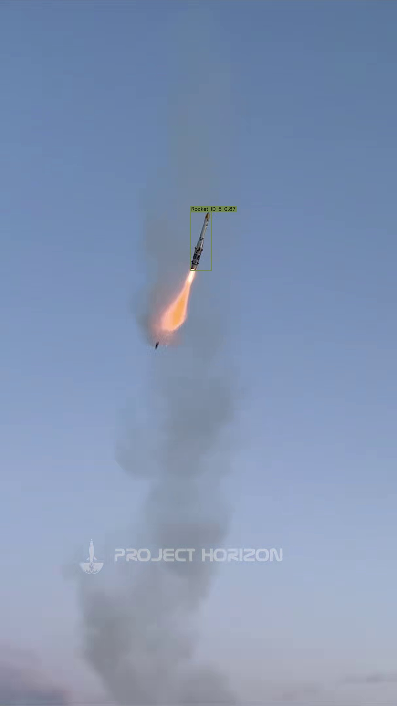

# rocket-track

I built this to detect and track rockets in launch footage — domain-tuned YOLO, a SORT tracker I implemented myself, and honest latency numbers on my RTX 4060 laptop. The goal is software that’s fast enough on the 4060 that a Jetson port has a fighting chance, not “it runs in a notebook.”

**FPS bar I’m aiming for:** about **60 FPS** end-to-end (detect + track) on CUDA. **30 FPS** is the real-time floor. If I’m under 30 on a 4060, I fix the model/`imgsz` before blaming the Jetson.




## Quickstart

```bash
python -m venv .venv
.venv\Scripts\activate          # Windows
pip install -r requirements.txt
pip install -e .                # optional

# Track the launch clip (annotated MP4 lands in outputs/tracked/)
python -m scripts.run_track --source testing_media/rocket_launch.mov --device auto --profile fast --out outputs/tracked
```

Open `outputs/tracked/rocket_launch_tracked.mp4` to review boxes + IDs.

Profiles:

| Profile | imgsz | conf | Intent |
|---------|------:|-----:|--------|
| `fast` (default) | 512 | 0.30 | Speed / closed-loop headroom |
| `quality` | 640 | 0.25 | Best recall on tiny distant rockets |
| `realtime` | 416 | 0.35 | Aggressive FPS |

FP16 is on automatically for CUDA; off for CPU. `--device auto` falls back to CPU if PyTorch can’t see a GPU.

```bash
python -m pytest tests -q
python -m scripts.smoke_check --track --device cpu
```

## What’s in the box

- **Detector:** YOLOv8s fine-tuned on my rocket dataset (`weights/best.pt`)
- **Tracker:** in-repo SORT (`src/rocket_track/track_sort.py`) — Kalman + IoU + Hungarian, not a wrapper around `model.track()`
- **Bench:** same media across PyTorch / ONNX; TensorRT is N/A until I export an engine on a machine that has it
- **Demo media:** `testing_media/rocket_launch.mov` (plus `testvid.mp4` / samples)

## Where to look after a run

| Output | Path |
|--------|------|
| Annotated launch track | `outputs/tracked/rocket_launch_tracked.mp4` |
| Bench CSV / plots | `assets/results/bench_*.csv` |
| Still demos | `assets/results/demo_track_still.jpg` |

`outputs/` is gitignored — it’s for local review.

### Latest local track (this machine)

Source: `testing_media/rocket_launch.mov`, profile `fast` (imgsz 512).

| Device | Frames | Frames w/ tracks | End-to-end FPS | Notes |
|--------|-------:|-----------------:|---------------:|-------|
| CPU (PyTorch) | 814 | 239 (29.4%) | **10.82** | GPU wasn’t visible to torch in that session (`cuda False`) |
| CUDA 4060 @ 640 (earlier detect-only bench) | — | — | **~40** detect-only | See bench table below; re-run track with GPU for e2e number |

When the 4060 is visible again:

```bash
python -m scripts.run_track --source testing_media/rocket_launch.mov --device cuda --profile fast --out outputs/tracked
python -m scripts.run_track --source testing_media/rocket_launch.mov --device cuda --profile quality --out outputs/tracked_quality
```

## Detector weights

| Path | Role |
|------|------|
| `weights/best.pt` | Default product weights |
| `weights/best.onnx` | ONNX Runtime benches |
| `runs/train/rocket_detector/weights/` | Local training dump (mostly gitignored) |

```bash
python -m scripts.export_onnx --weights weights/best.pt --out weights/best.onnx
```

## Dataset

Labels for `train/` / `valid/` / `test/` are in git. Full images are **not** (~70GB) — see [`docs/DATASET.md`](docs/DATASET.md).

Roboflow: `arbalesttest` / `rocket-tracking-pduic-ay8b4` v1, CC BY 4.0.

### Val metrics (epoch 200, existing run)

From `runs/train/rocket_detector/results.csv`:

| Metric | Value |
|--------|------:|
| mAP50 | 0.882 |
| mAP50-95 | 0.661 |
| Precision | 0.928 |
| Recall | 0.790 |


## Benchmarks (detect-only)

```bash
python -m scripts.run_bench --source testing_media/testvid.mp4 --weights weights/best.pt --out assets/results/
```

### RTX 4060 laptop — `windows-rtx4060-8gb-amd64`

imgsz 640, warmup 10, 40 timed frames:

| Backend | Mean (ms) | FPS | Peak VRAM (MB) | Notes |
|---------|----------:|----:|---------------:|-------|
| pytorch_cpu | 110.75 | 9.03 | N/A | |
| pytorch_cuda | 25.08 | 39.88 | 78.4 | |
| onnx_cpu | 144.33 | 6.93 | N/A | |
| onnx_cuda | — | — | N/A | CUDA EP not installed |
| tensorrt | — | — | N/A | Engine not packaged |

Files: [`assets/results/`](assets/results/). More notes: [`docs/BENCHMARKS.md`](docs/BENCHMARKS.md).

**Thermal caveats:** same power mode, discard warmup, don’t mix cloud vs laptop numbers, never invent TensorRT FPS.

## CLI

```bash
python -m scripts.run_track --source testing_media/rocket_launch.mov --profile fast --device auto --out outputs/tracked
python -m scripts.run_bench --source testing_media/rocket_launch.mov --out assets/results/
python -m scripts.export_onnx --weights weights/best.pt --out weights/best.onnx
python -m scripts.smoke_check --track
python -m scripts.train --data data.yaml   # full retrain; usually skip
```

## Layout

```
.
├── testing_media/rocket_launch.mov   # primary launch clip
├── outputs/tracked/                  # annotated videos (local)
├── weights/best.pt
├── src/rocket_track/                 # detect, SORT, pipeline, bench
├── scripts/run_track.py
├── configs/fast.yaml
├── assets/sample/ demo_rocket.jpg
├── docs/
└── tests/
```

## Method

1. Detect with the rocket-tuned YOLOv8s weights  
2. Track with in-repo SORT  
3. Optimize for FPS via `imgsz` profiles + CUDA FP16 before chasing exotic backends  

FPS-first notes: [`docs/superpowers/specs/2026-08-22-fps-first-tracking-design.md`](docs/superpowers/specs/2026-08-22-fps-first-tracking-design.md).

## Limitations

- SORT has no ReID — IDs can switch under heavy occlusion  
- Full dataset images aren’t in git  
- TensorRT / Jetson numbers aren’t claimed until measured on device  
- ByteTrack is optional comparison only  

## Acknowledgments

Ultralytics, Roboflow, SORT (Bewley et al.), and Arbalest club imagery/labeling context. See `NOTICE.md`.

## License

MIT — `LICENSE`. Dataset: CC BY 4.0 per `data.yaml`.
