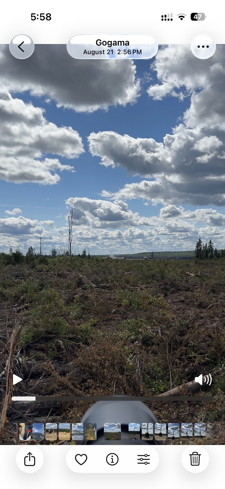

# rocket-track

Detect and track rockets in launch video: domain-tuned YOLOv8, in-repo SORT (with coasting), and honest latency benches.

**FPS goal:** ~60 detect+track on CUDA (30 is the real-time floor). On an RTX 4060 Laptop, **TensorRT clears that** (~90–98 e2e / ~105–118 infer).



## Quickstart

```bash
python -m venv .venv
.venv\Scripts\activate
pip install -r requirements.txt

python -m scripts.run_track --source testing_media/rocket_launch.mov --device auto --profile quality --out outputs/tracked
```

Open `outputs/tracked/rocket_launch_tracked.mp4`.

| Profile | imgsz | conf | Weights | Use |
|---------|------:|-----:|---------|-----|
| `fast` (default) | 512 | 0.25 | `best.pt` | Speed + solid hit-rate |
| `quality` | 640 | 0.20 | `best.pt` | Best recall on launch video |
| `realtime` | 416 | 0.35 | `best_n.pt` if present | Smaller input / nano |

`--coast-frames` defaults to **25** (Kalman fill through short misses; `0` = classic SORT). FP16 on for GPU.

### Track quality — `rocket_launch.mov` (814 frames, `best.pt`, FP16)

From `assets/results/quality_bakeoff.csv`:

| Setting | Hit-rate | Infer FPS |
|---------|---------:|----------:|
| fast conf0.30 coast**0** | 29.4% | ~35 |
| fast conf0.30 coast15 | 64.9% | ~36 |
| **fast conf0.25 coast25** (new default knobs) | **82.1%** | ~43 |
| **quality conf0.20 coast25** | **90.5%** | ~42 |
| quality conf0.15 coast25 | 94.3% | ~41 |

Demo videos (local): `outputs/compare/` (`01_nocoast` → `02_coast` → `03_quality` → `04_nano`).

### Speed — TensorRT (imgsz 512, older coast=0 numbers)

| Weights | Mode | e2e FPS | Infer FPS |
|---------|------|--------:|----------:|
| `best.engine` | `--no-save` | **90.0** | **105.3** |
| `best_n.engine` | `--no-save` | **98.4** | **118.0** |

Engines are GPU-local (gitignored). Rebuild: `pip install tensorrt==10.3.0 && python -m scripts.export_engine`.

```bash
python -m scripts.run_track --source testing_media/rocket_launch.mov --device cuda --profile quality --half --out outputs/tracked
python -m scripts.quality_bakeoff --device cuda
python -m scripts.export_hard_frames --source testing_media/rocket_launch.mov --device cuda
python -m pytest tests -q
```

## Layout

| Path | Purpose |
|------|---------|
| `src/rocket_track/` | Library: detect, SORT, pipeline, backends, bench |
| `scripts/` | CLIs (see below) |
| `weights/` | `best.pt` / `best_n.pt` (+ ONNX); `*.engine` local only |
| `testing_media/` | Launch clips |
| `outputs/` | Compare demos + hard-frame dumps (gitignored); see `outputs/compare/README.md` |
| `assets/results/` | Bench / bake-off CSV |
| `configs/` | `default.yaml`, `fast.yaml`, `bytetrack.yaml` |
| `data.yaml` + `train/` `valid/` `test/` | Labels in git; **images gitignored** |
| `runs/train/` | Training curves |
| `docs/DATASET.md` | Download full images |
| `tests/` | Unit tests |

## Scripts

| Command | Role |
|---------|------|
| `python -m scripts.run_track` | Detect + SORT (or ByteTrack) |
| `python -m scripts.quality_bakeoff` | Hit-rate bake-off (conf / imgsz / coast) |
| `python -m scripts.export_hard_frames` | Dump miss frames for labeling / retrain |
| `python -m scripts.run_bench` | Backend latency table |
| `python -m scripts.compare_speed` | Infer FPS across weight files |
| `python -m scripts.export_onnx` / `export_engine` | ONNX / TensorRT export |
| `python -m scripts.train` / `train_nano` | Fine-tune s / n |
| `python -m scripts.smoke_check` | Sanity check |

## Weights

- `weights/best.pt` — default (YOLOv8s)
- `weights/best_n.pt` — YOLOv8n; used by `realtime` when present
- `weights/*.onnx` — ONNX; `*.engine` — TensorRT (local)

## Dataset

Single class `Rocket`. **Labels in git; images never committed** (`train/images/**` etc. in `.gitignore`). Unpack Roboflow locally to retrain — see [`docs/DATASET.md`](docs/DATASET.md).

| Model | mAP50 | mAP50-95 | Precision | Recall |
|-------|------:|---------:|----------:|-------:|
| YOLOv8s (epoch 200) | 0.882 | 0.661 | 0.928 | 0.790 |
| YOLOv8n (best epoch 39) | 0.838 | 0.612 | 0.878 | 0.760 |

To improve further: label `outputs/hard_frames/` misses, merge into train, retrain.

## Tracking

**SORT** + coasting (`--coast-frames`, default 25). Coasted boxes are thinner and labeled `~`. Optional: `--tracker bytetrack`.

## Benchmarks

```bash
python -m scripts.run_bench --source testing_media/testvid.mp4 --out assets/results/
python -m scripts.compare_speed --weights weights/best.pt weights/best_n.pt --device cuda
python -m scripts.quality_bakeoff --device cuda
```

Artifacts: `assets/results/quality_bakeoff.csv`, `speed_compare.csv`, `bench_windows-rtx4060-8gb-amd64.*`.

## Limitations

- SORT has no ReID; IDs can switch under long occlusion
- Training images are local-only (gitignored)
- TensorRT engines are GPU-specific (`tensorrt==10.3.0` on CUDA 12; TRT 11 breaks Ultralytics export)

## License

MIT (`LICENSE`). Dataset CC BY 4.0. Acknowledgments: Ultralytics, Roboflow, SORT, Arbalest — see `NOTICE.md`.
