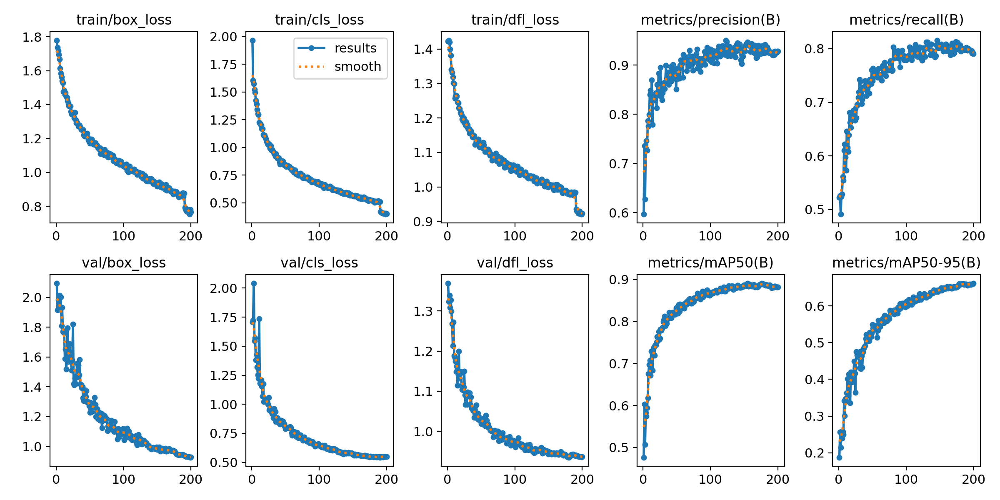

# rocket-track

Detect and track rockets in launch video using a domain-tuned YOLO detector, a from-scratch SORT tracker, and honest PyTorch / ONNX / (TensorRT) latency benchmarks on an RTX 4060.




## Problem

Hobby and club launch footage is messy: small rockets, motion blur, bright sky, and camera shake. Off-the-shelf COCO detectors are the wrong prior. This toolkit keeps a **rocket-fine-tuned YOLOv8s** detector, adds an **in-repo SORT** tracker (Kalman + IoU + Hungarian — not a thin `model.track()` wrapper), and measures inference backends on the **same** rocket media.

## Quickstart

```bash
python -m venv .venv
# Windows:
.venv\Scripts\activate
pip install -r requirements.txt
# optional editable install:
pip install -e .

# CPU smoke track on bundled sample / testing media
python -m scripts.run_track --source testing_media/testvid.mp4 --weights weights/best.pt --tracker sort --device cpu --out outputs/track

# Or a still from assets/sample
python -m scripts.run_track --source assets/sample/IMG_0026.png --weights weights/best.pt --device cpu --out outputs/track_img
```

CUDA (when available):

```bash
python -m scripts.run_track --source testing_media/testvid.mp4 --weights weights/best.pt --tracker sort --device cuda --out outputs/track
```

`--device auto` (default for `run_track`) selects CUDA when PyTorch sees a GPU.

Tests / smoke:

```bash
python -m pytest tests -q
python -m scripts.smoke_check --track --device cpu
```

## Detector weights

| Path | Role |
|------|------|
| `weights/best.pt` | **Default** product weights (YOLOv8s, rocket class) |
| `weights/best.onnx` | ONNX export for Runtime benches |
| `runs/train/rocket_detector/weights/best.pt` | Local training output (may be gitignored / large) |

If `weights/` is missing in a shallow clone, re-export after training or copy from `runs/train/rocket_detector/weights/`.

```bash
python -m scripts.export_onnx --weights weights/best.pt --out weights/best.onnx
```

## Dataset

Canonical layout (unchanged from the Roboflow export):

- `data.yaml` — single class `Rocket`
- `train/`, `valid/`, `test/` — YOLO labels are in git; **full images are gitignored** (~70GB locally)

Full download steps: [`docs/DATASET.md`](docs/DATASET.md).

Roboflow (from `data.yaml`):

- workspace: `arbalesttest`
- project: `rocket-tracking-pduic-ay8b4`
- version: `1`
- license: CC BY 4.0

Re-download the YOLOv8 export into this folder (so `train/images` etc. reappear), or keep using `assets/sample/` + `testing_media/` for smoke runs.

Local training recipe (200 epochs, RTX 4060–oriented) lives in `scripts/train.py`. Prefer existing `weights/best.pt` unless you intentionally retrain.

### Published val metrics (epoch 200, existing run)

From `runs/train/rocket_detector/results.csv` (not invented):

| Metric | Value |
|--------|------:|
| mAP50 | 0.882 |
| mAP50-95 | 0.661 |
| Precision | 0.928 |
| Recall | 0.790 |

See also `runs/train/rocket_detector/results.png` and PR / F1 curves in that folder. Detector val preview: [`assets/results/demo_detect_val.jpg`](assets/results/demo_detect_val.jpg).

## Tracking

Default tracker: **SORT** (`src/rocket_track/track_sort.py`).

```bash
python -m scripts.run_track --tracker sort ...
# Optional Ultralytics ByteTrack comparison only:
python -m scripts.run_track --tracker bytetrack ...
```

## Benchmarks

```bash
python -m scripts.run_bench --source testing_media/testvid.mp4 --weights weights/best.pt --backends pytorch_cpu,pytorch_cuda,onnx_cpu,onnx_cuda,tensorrt --out assets/results/
```

Writes `assets/results/bench_<platform_id>.{csv,md,png}`.

### Author machine — `windows-rtx4060-8gb-amd64`

NVIDIA GeForce RTX 4060 Laptop GPU (8GB), Windows. Source: `testing_media/testvid.mp4`, `imgsz=640`, warmup=10, timed frames=40.

| Backend | Mean (ms) | Median (ms) | P95 (ms) | FPS | Peak VRAM (MB) | Notes |
|---------|----------:|------------:|---------:|----:|---------------:|-------|
| pytorch_cpu | 110.75 | 110.20 | 116.46 | 9.03 | N/A | |
| pytorch_cuda | 25.08 | 24.82 | 31.71 | 39.88 | 78.4 | |
| onnx_cpu | 144.33 | 139.14 | 185.45 | 6.93 | N/A | |
| onnx_cuda | — | — | — | — | N/A | CUDA EP not installed |
| tensorrt | — | — | — | — | N/A | Engine not packaged |

Artifacts: [`assets/results/bench_windows-rtx4060-8gb-amd64.md`](assets/results/bench_windows-rtx4060-8gb-amd64.md) · [CSV](assets/results/bench_windows-rtx4060-8gb-amd64.csv) · [chart](assets/results/bench_windows-rtx4060-8gb-amd64.png)

Details: [`docs/BENCHMARKS.md`](docs/BENCHMARKS.md).

### Thermal / fairness caveats

- Use a consistent Windows power mode; laptop GPUs throttle when hot.
- Discard warmup (default 30 frames); do not compare a cold first run to steady-state.
- Do not mix cloud GPU numbers with this laptop table.
- Missing ONNX CUDA EP or TensorRT → **N/A + reason**, never fabricated FPS.

## CLI reference

```bash
python -m scripts.run_track --source <path> --weights weights/best.pt --tracker sort --device auto|cpu|cuda --out outputs/track
python -m scripts.run_bench --source <path> --weights weights/best.pt --out assets/results/
python -m scripts.export_onnx --weights weights/best.pt --out weights/best.onnx
python -m scripts.smoke_check --track
python -m scripts.train --data data.yaml   # full retrain; usually unnecessary
```

## Layout

```
.
├── data.yaml train/ valid/ test/   # labels in git; images local/Roboflow
├── weights/best.pt|.onnx
├── src/rocket_track/               # detect, SORT, pipeline, backends, bench
├── scripts/                        # CLIs
├── assets/sample/ results/
├── configs/default.yaml
├── docs/
├── tests/
├── legacy/                         # old one-off scripts
├── testing_media/
└── runs/train/rocket_detector/     # curves / metrics plots
```

## Method (short)

1. **Detect** — Ultralytics YOLOv8s fine-tuned on the rocket dataset (`imgsz=640`).
2. **Track** — SORT with constant-velocity Kalman, IoU cost, Hungarian assignment, `max_age` / `min_hits`.
3. **Benchmark** — shared frames across PyTorch CPU/CUDA and ONNX Runtime; TensorRT skipped unless you export an engine locally.

## Limitations

- SORT is association-only (no ReID); ID switches under heavy occlusion are expected.
- Full train/val images are not in git (size); clones need Roboflow or a private mirror for retraining.
- TensorRT is optional and not shipped.
- ByteTrack path is comparison-only via Ultralytics.

## Acknowledgments

Ultralytics YOLOv8, Roboflow (dataset export), SORT (Bewley et al., 2016), and Arbalest rocketry club imagery/labeling context. See `NOTICE.md`.

## License

MIT — see `LICENSE`. Dataset terms follow the Roboflow export (CC BY 4.0 per `data.yaml`).
